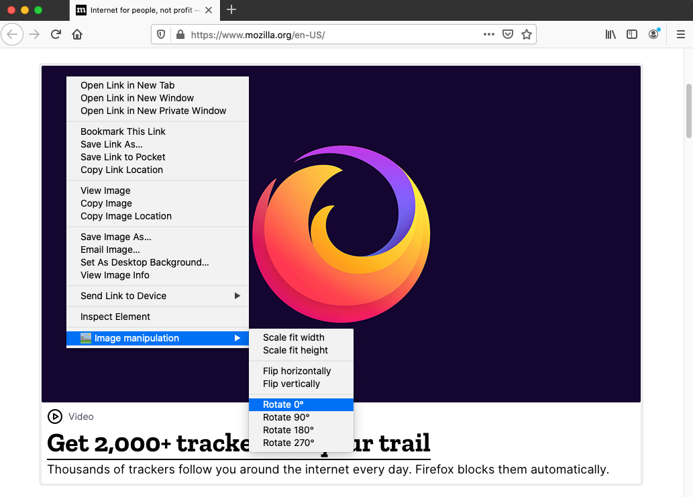

# Firefox image manipulation extension

**This add-on injects JavaScript into web pages. The `addons.mozilla.org` domain disallows this operation, so this add-on will not work properly when it's run on pages in the `addons.mozilla.org` domain.**

I wanted to know what it took to develop a Firefox extension which could manipulate images. This repo is the result. I was quite surprised how well Mozilla [documented](https://developer.mozilla.org/en-US/docs/Mozilla/Add-ons/WebExtensions) the development process. Another great help is their [repo](https://github.com/mdn/webextensions-examples) full with [example code](https://github.com/mdn/webextensions-examples).

In two hours I had the image flipping working. The hardest part was to figure out how to get access to the image so I could manipulate it. At the bottom of this readme you'll find the links I used for developing this extension.

## Features

- Scale to fit width
- Scale to fit height
- Flip horizontally
- Flip vertically
- Rotate 0°
- Rotate 90°
- Rotate 180°
- Rotate 270°

## How to use
Right-click on any image and select "Image manipulation" from the context menu.

## Screenshot


# Development
This project uses [Web-ext](https://github.com/mozilla/web-ext), a command line tool to help build, run, and test WebExtensions

Run `web-ext` with `src` as the source folder
```
npx web-ext -s src run
```

This will open a new Firefox instance with the plugin loaded.

# Learn about Firefox extention development

These links were very useful when learning to make this Firefox extension:
- [Your first extensions](https://developer.mozilla.org/en-US/docs/Mozilla/Add-ons/WebExtensions/Your_first_WebExtension)
- [Context menu items](https://developer.mozilla.org/en-US/docs/Mozilla/Add-ons/WebExtensions/user_interface/Context_menu_items)
- [menus.getTargetElement()](https://developer.mozilla.org/en-US/docs/Mozilla/Add-ons/WebExtensions/API/menus/getTargetElement)
- [Anatomy of an extension](https://developer.mozilla.org/en-US/docs/Mozilla/Add-ons/WebExtensions/Anatomy_of_a_WebExtension#Background_scripts)